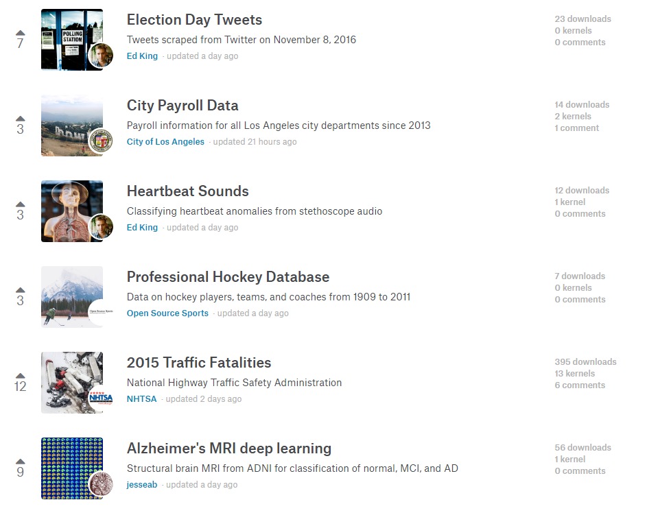
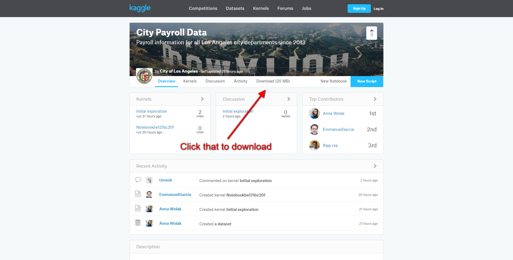

## Introduction

There are lots of ways to read data into R. The one that I have been having you use is probably the simplest because it takes zero work on your end. Essentially what the following command does it just download the .csv straight from the SIU website and load it into R. Here's the command you've been familiar with:

```{r message=FALSE, warning=FALSE}
simon <- read.csv(url("http://goo.gl/exQA14"))
```

So, left to right. We are calling our dataset "simon", it's a .csv file (which is a very basic type of data file that works in almost every situation), and then the web address where the data can be found: http://goo.gl/exQA14.

But what if you just found some data online somewhere and you want to load that into R. How do you go about doing that? 

## Manually loading data

Let's say you find some data to download. I will use Kaggle as a good example. They have some cool datasets.



## Downloading the data

I like that "City Payroll Data", how do we get it? 



## Unzipping the data

I downloaded it and unzipped. Now I have a .csv file called data.csv


## Importing into R Studio

So, now I need ot get that into R Studio. Lucky for us, R Studio just added a nice import option. 


## Importing Data Options

You can import data from all sorts of formats including SPSS, Stata, Excel, or CSV. For us, we have a CSV file so let's go to that option. 


You need to do two things. 

1. In the top right there is a browse button. You can click that and it will open up "File Explorer" then you can just navigate to where you have saved your data file. For me, that was my desktop. When you do that R Studio will give you a nice little preview of the data. 

2. You need to determine what you are gonna call your dataset. We have always called ours "simon" because it's short and tells us what our data is. You can call it whatever. "df" is popular among the R community. So is "data." Just type that name into the bottom left box called "Name"

You should see in the bottom right box the exact code that R is going to use to open that data. Click import. 

I called mine "df."

## Final Results


To make sure it worked just do: 

```{r message=FALSE, warning=FALSE, echo=FALSE}
library(readr)
df <- read_csv("C:/Users/Ryan Burge/Desktop/data.csv")
View(df)
```

```{r message=FALSE, warning=FALSE}
head(df)
```

## Where to find data? 

1. [Kaggle](https://www.kaggle.com) has a lot of crowd sourced datasets from all over the place. 
2. [Data.World](https://data.world/) is a newer website that has people upload interesting data. 
3. [General Social Survey](http://gss.norc.org/) is the most widely used social science dataset. It goes back to 1972 and asks questions about all sorts of behavior and politics. 
4. [National Election Study](http://www.electionstudies.org/) is the most comprehensive dataset of political behavior and opinion that exists. It goes back to 1948 and asks a lot of questions of interest to political scientists. 
5. [World Values Survey](http://www.worldvaluessurvey.org/wvs.jsp) is terrific if you are looking at comparative politics. It does a sample of almost all the countries on Earth on a rotation basis every five years. 

